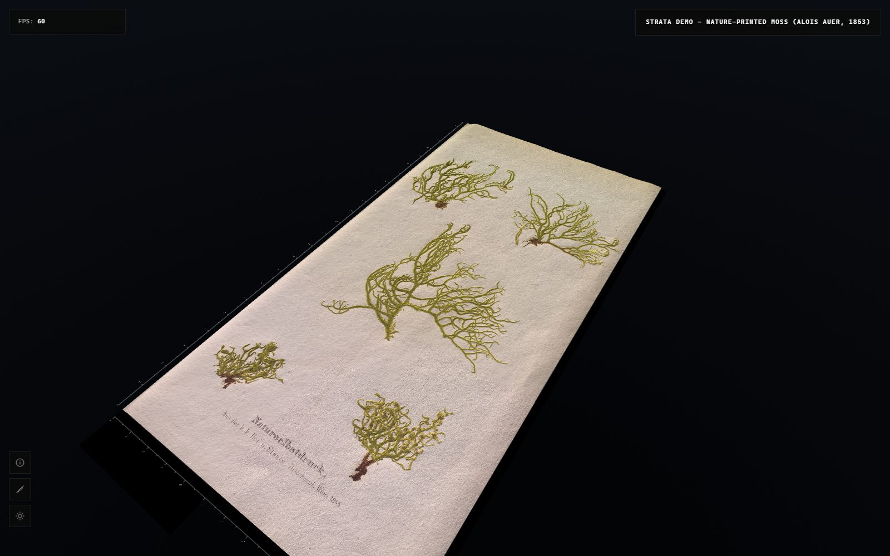

# Strata Viewer

Strata Viewer is a web viewer for high resolution surface scans. It streams
albedo and height tiles and renders them as a 3D relief that you can
relight, measure and inspect in the browser. It is built with three.js and
a quadtree LOD streamer, and it works inside the IIIF ecosystem.



**[Live demo](https://factumfoundation.xyz/strata-viewer/demo/)** · **[User manual](docs/manual/index.md)** · [](https://doi.org/10.5281/zenodo.21614286)

## Features

- Quadtree tile streaming (TMS pyramid) with screen space error LOD
- Works from real scan data. The input is a floating point depthmap in
  metres (32 or 64 bit TIFF) plus a colour image. The tools convert them
  into compact 16 bit tiles for the GPU.
- Switchable height channels, for example filtered relief and full surface
- Interactive relighting and shadows
- Measurement tools: distances, height differences, elevation profiles
- IIIF: Presentation 3 manifest generator, static Image API level-0
  packager, and the viewer can boot straight from a IIIF manifest

## Quickstart

Requirements: Node 20+, [uv](https://docs.astral.sh/uv/).

```bash
git clone https://github.com/FactumFoundation/strata-viewer.git
cd strata-viewer
npm install
uv sync
uv run python scripts/generate_tiles.py   # tiles from the bundled sample
npm run dev                               # open http://localhost:5173/demo/
```

`generate_tiles.py` reads the sample dataset in `data/sample/` and writes a
tile pyramid to `public/moss/`. `npm run dev` starts Vite. Open
`http://localhost:5173/demo/` to see the moss plate rendered as a lit
relief. Note that `public/moss/` is generated output and is not tracked by
git, so after a fresh clone you always run the generator first.

The sample is a nature printed moss from Alois Auer's *Der polygraphische
Apparat* (Vienna, 1853). In a Naturselbstdruck, or nature print, the
specimen itself was pressed between a soft lead plate and a hard steel
plate, so the plant left its own topography in the printing plate. What you
see in the viewer is a relief scan of that impression, not a photograph.

## IIIF

Strata publishes and consumes [IIIF](https://iiif.io/). A IIIF Presentation
3 manifest exposes the albedo in any standard 2D viewer such as Mirador,
Universal Viewer or OpenSeadragon. The same manifest carries the height
channels as an extension of the ARCHiOx LightingMap pattern
(`mapType: "height"`), and Strata reads them to build the displaced
surface. Tiles are served as a static Image API 3.0 level-0 tree. These are
plain files, so no image server is required.

```bash
# TMS tile pyramid -> static Image API level-0 tree (info.json + tiles)
uv run python scripts/generate_iiif_level0.py \
    --metadata public/moss/metadata.json \
    --base-url http://localhost:5173/moss/iiif

# metadata.json -> IIIF Presentation 3 manifest
uv run python scripts/generate_iiif_manifest.py \
    --metadata public/moss/metadata.json \
    --base-url http://localhost:5173/moss/iiif \
    --label "Nature-printed moss, Alois Auer, 1853" \
    --out public/moss/iiif/manifest.json
```

`generate_iiif_level0.py` writes the tile tree to an `iiif/` directory next
to `metadata.json` by default. `generate_iiif_manifest.py` writes
`manifest.json` next to `metadata.json` unless you pass `--out`, so use
`--out` as above to keep the manifest next to the level-0 tree. That is
where the demo and the test pages expect it. Boot the demo from the
manifest with:

```
http://localhost:5173/demo/?manifest=http://localhost:5173/moss/iiif/manifest.json
```

Without the parameter the demo falls back to the local `metadata.json`.

Test pages for the three viewers live in `examples/iiif-test/`.
`index.html` (Mirador) and `uv.html` (Universal Viewer) consume a
Presentation manifest via `?manifest=<url>` and default to the local moss
manifest. `osd.html` (OpenSeadragon) talks Image API directly, so it takes
`?base=<url>` pointing at a level-0 tree and opens `<base>/albedo/info.json`
as its tile source. These three viewers are the ones the project has been
tested against.

## Full-resolution dataset

The bundled sample is a 2048x2048 centre crop, so the repo stays small and
`git clone` stays fast. The complete plate is hosted externally as a zip of
about 1.3 GB. It contains the raw 32 bit float depthmap in metres and the
16 bit RGB albedo, 9998x19172 pixels at 12.3 µm per pixel.

```bash
# download the zip from https://factumfoundation.xyz/strata-viewer/downloads/auer-moss-complete.zip and unzip into data/, then:
uv run python scripts/extract_hf_relief.py \
    --src data/auer-moss-complete/depthmap_m1_f32.tif \
    --cutoff 0.005 --out data/auer-moss-complete/depthmap_hf.tif
uv run python scripts/convert_scan.py \
    --src data/auer-moss-complete --albedo albedo_m1.tif \
    --channel height_hf=depthmap_hf.tif --channel height_full=depthmap_m1_f32.tif \
    --factor 2 --clip 0.5 --name auer-moss-complete --out data/full_object
uv run python scripts/generate_tiles.py --src data/full_object
```

`--factor 2` builds a 4999x9586 dataset, which is a big step up from the
sample and runs comfortably with 8 GB of RAM. `--factor 1` keeps the full
resolution and needs around 16 GB. `--clip 0.5` trims the extreme half
percent of heights, which protects the range from the sharp drop at the
physical edges of the plate. The conversion runs on your machine against
the raw depthmap, so no height precision is lost in the download. The
commands overwrite `public/moss/` with a deeper pyramid and nothing else
changes. Just reload `http://localhost:5173/demo/`.

## Using your own scan

The normal starting point is the raw output of a surface scanner: one or
more floating point depthmaps in metres (32 or 64 bit TIFF) and a colour
image. Selene PSS exports the surface twice, with and without the low
frequency warp of the object, and both go in as separate height channels:

```bash
uv run python scripts/convert_scan.py \
    --src path/to/your_scan --albedo albedo.tif \
    --channel height_hf=depthmap_hf.tif --channel height_full=depthmap.tif \
    --pixel-size 1.23e-05 --out data/your_dataset
```

`--pixel-size` is the size of one pixel in metres, usually found in the
`.tfw` world file of the scan. The converter only scales and quantises, it
does not change the data.

If your scanner exports a single depthmap, you can derive the filtered
relief channel yourself first:

```bash
uv run python scripts/extract_hf_relief.py \
    --src path/to/your_scan/depthmap.tif \
    --cutoff 0.005 --out path/to/your_scan/depthmap_hf.tif
```

`--cutoff` controls the high pass filter that separates the fine relief
from the overall warp. Pick it a little above the scale of the relief
detail you care about. For printing plates and paper 5 mm works well at
any object size. Larger values keep broader undulations in the relief
channel.

The converter writes an intermediate dataset directory. You can also build
one by hand if your data is already in 16 bit form:

```
your_dataset/
  dataset.json
  albedo.png       # 8 bit RGB
  height_hf.png    # 16 bit height field (any name, referenced from dataset.json)
  height_full.png  # optional: as many height channels as you like
```

`dataset.json` fields:

| Field | Meaning |
|---|---|
| `name` | dataset identifier, printed by the tile generator |
| `credit` (optional) | attribution line, recorded in the dataset manifest (not surfaced by the viewer) |
| `pixelSizeMM` | physical size of one source pixel, in millimetres. It drives the on screen ruler and the measurement tool. |
| `albedo` | filename of the 8 bit RGB colour image |
| `heightChannels` | map of channel name to `{ file, heightRangeMM }`. `file` is a 16 bit single channel height PNG with the same pixel dimensions as `albedo`. `heightRangeMM` is the physical height range that the 16 bit values (0 to 65535) span. |
| `defaultHeightChannel` | which entry in `heightChannels` loads by default |

Generate the tile pyramid with:

```bash
uv run python scripts/generate_tiles.py --src data/your_dataset --out public/your_dataset
```

The generator pads the image to the smallest power-of-two square canvas and
writes 256px TMS tiles per channel (`{channel}/{z}/{col}/{row}.png`, with
the 16 bit height packed as R = high byte, G = low byte). It also writes a
`metadata.json` manifest describing the pyramid (tile size, levels, per
channel `zScale` and so on). That manifest is what the viewer loads at
runtime, not `dataset.json`.

To point the demo at your dataset, edit the `fetch('../moss/metadata.json')`
and `tileBaseUrl: '../moss/'` lines in `demo/main.js`. You can also load a
dataset without touching the code by passing `?manifest=`, see
[IIIF](#iiif) above.

## Building a viewer with the library

The core is two classes. `QuadTree` computes which tiles are visible at the
current camera position and screen space error threshold. `StrataRenderer`
owns the three.js meshes, materials and tile streaming for those tiles. A
minimal boot sequence, condensed from `demo/main.js`:

```js
import { QuadTree } from './src/QuadTree.js';
import { StrataRenderer } from './src/StrataRenderer.js';

const metadata = await fetch('./moss/metadata.json').then(r => r.json());

const quadTree = new QuadTree({ maxLevel: metadata.maxLevel });
const terrain = new StrataRenderer(scene, metadata, {
  tileBaseUrl: './moss/',
  heightChannel: metadata.defaultHeightChannel,
  zExaggeration: 1.0,
  segments: 256,
});

function loop() {
  requestAnimationFrame(loop);
  quadTree.update(camera, renderer.domElement.height, /* maxSSE */ 16, /* maxTiles */ 400);
  terrain.update(quadTree.leaves);
  renderer.render(scene, camera);
}
loop();
```

`scene`, `camera` and `renderer` are plain three.js objects that you create
yourself. See `demo/main.js` for the full setup: shadows, relighting,
measurement, IIIF manifest loading and UI wiring.

## Examples

| Example | What it shows | Setup |
|---|---|---|
| [`demo/`](demo/) | Full viewer: moss dataset, relighting, measurement, IIIF boot | `uv run python scripts/generate_tiles.py` |
| [`examples/01-quadtree-basico/`](examples/01-quadtree-basico/) | Bare quadtree LOD with procedural textures, no scan data involved | `npm run generate-tiles` (writes procedural tiles to `public/tiles/`) |
| [`examples/02-streaming/`](examples/02-streaming/) | The same quadtree, but tiles are streamed from disk instead of generated on the fly | `npm run generate-tiles` |
| [`examples/iiif-test/`](examples/iiif-test/) | Three static test pages (Mirador, Universal Viewer, OpenSeadragon) that load a IIIF packaged dataset | see [IIIF](#iiif) above |

All example pages are served by the same dev server, for example
`http://localhost:5173/examples/01-quadtree-basico/`.

## Development

```bash
npm test          # JS unit tests (vitest)
uv run pytest     # Python tests, tile generator + IIIF manifest
```

Repo layout:

```
src/          viewer library: QuadTree, StrataRenderer, IIIF loader, tools
demo/         the full demo (moss dataset)
examples/     smaller, focused examples (quadtree basics, streaming, IIIF test pages)
scripts/      Python tile and IIIF generators, plus the JS procedural tile generator
data/sample/  bundled sample dataset (dataset.json + source images)
```

## License and credits

Apache License 2.0, see [LICENSE](LICENSE).

Copyright (c) 2026 Jorge Cano.

Developed for Factum Foundation and the Selene Circle.

Sample dataset: nature-printed moss, Alois Auer, *Der polygraphische
Apparat*, Vienna, 1853 (Naturselbstdruck). From the private collection of
Adam Lowe.

## Acknowledgements

Thanks to Richard Allen, author of the [ARCHiOx Mirador
plugin](https://github.com/bodleian/archiox-mirador-plugin), for the many
conversations that shaped the IIIF side of Strata, and for the work we
did together on [serving IIIF tiles as static
files](https://github.com/bodleian/iiif-static-choices). The way Strata
carries height channels in a manifest follows the LightingMap pattern of
his work for
[ARCHiOx](https://factumfoundation.org/our-projects/institutional-collaborations/archiox-analysing-and-recording-cultural-heritage-in-oxford/)
(Analysing and Recording Cultural Heritage in Oxford), a collaboration
between the Bodleian Libraries and Factum Foundation. Thanks to John
Barrett and the Bodleian Libraries for their support and suggestions, to
Adam Lowe for his support, and to [the Selene
Circle](https://factumfoundation.org/our-projects/institutional-collaborations/the-selene-circle/)
for the feedback that shapes the viewer.
