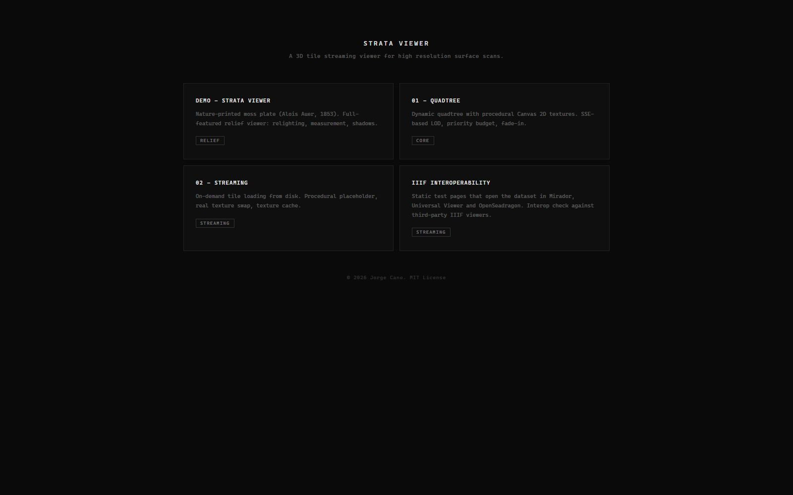
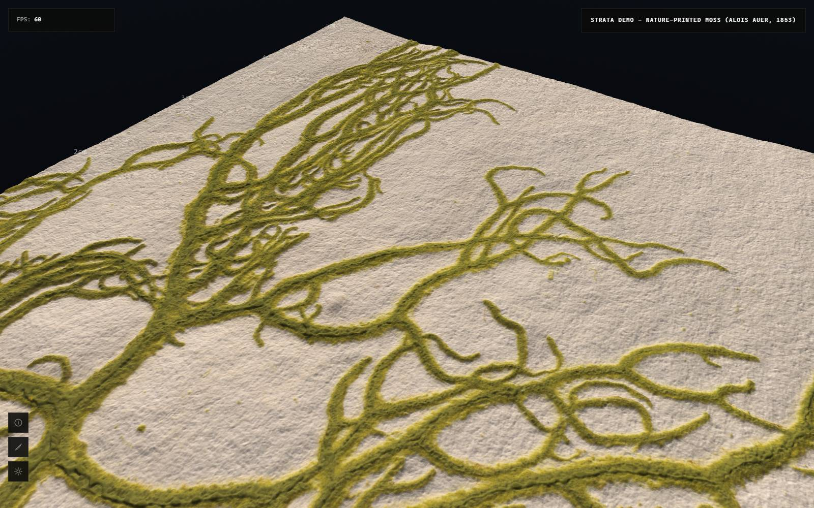

# Getting started

You need Node 20 or newer and [uv](https://docs.astral.sh/uv/). Then:

```bash
git clone https://github.com/FactumFoundation/tactum-viewer.git
cd tactum-viewer
npm install
uv sync
uv run python scripts/generate_tiles.py
npm run dev
```

The generator takes a few seconds. It reads the sample dataset in
`data/sample/` and writes a tile pyramid to `public/moss/`. This step is
needed after every fresh clone, because generated tiles are not stored in
git.

Open `http://localhost:5173/` and you will see the project page with links
to the demo and the examples.



Click the demo. After a moment the moss plate appears as a lit relief. You
can orbit with the left mouse button, pan with the right one and zoom with
the wheel.



If the page stays empty, check the terminal where `npm run dev` is running
and make sure the tile generator finished without errors.
