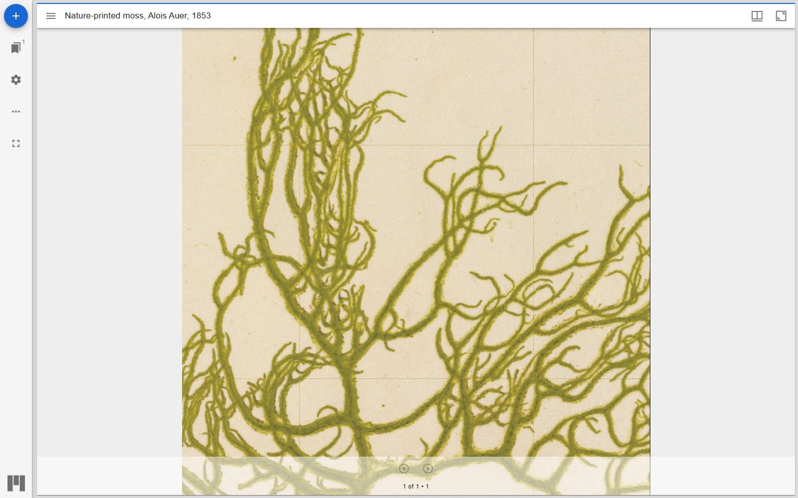
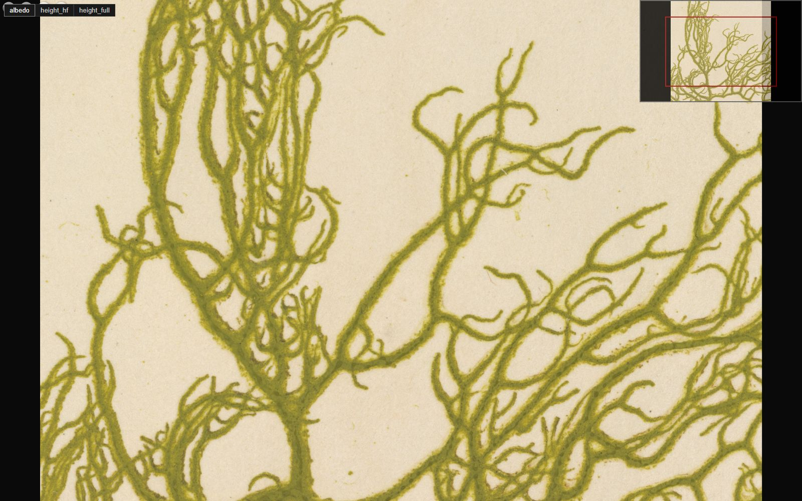

# IIIF

Tactum datasets can be published as [IIIF](https://iiif.io/) resources.
This gives you two things. Any standard IIIF viewer can show the albedo as
a deep zoom image. And Tactum itself can boot from a IIIF manifest, so a
dataset can live on any static server and be shared with a URL.

## Publishing a dataset

```bash
# tile pyramid -> static Image API level-0 tree
uv run python scripts/generate_iiif_level0.py \
    --metadata public/moss/metadata.json \
    --base-url http://localhost:5173/moss/iiif

# metadata.json -> IIIF Presentation 3 manifest
uv run python scripts/generate_iiif_manifest.py \
    --metadata public/moss/metadata.json \
    --base-url http://localhost:5173/moss/iiif \
    --label "Nature-printed moss, Alois Auer, 1853" \
    --out public/moss/iiif/manifest.json
```

The level-0 tree is plain files, so any web server can serve it. No image
server is needed. The manifest carries the height channels as an extension
of the ARCHiOx LightingMap pattern (`mapType: "height"`).

## Booting Tactum from a manifest

```
http://localhost:5173/demo/?manifest=http://localhost:5173/moss/iiif/manifest.json
```

Without the parameter the demo falls back to its local `metadata.json`.

## Standard viewers

The pages in `examples/iiif-test/` open the same dataset in three common
IIIF viewers. Mirador and Universal Viewer read the manifest. The
OpenSeadragon page talks to the Image API directly and takes a `?base=`
parameter instead.





A stock 2D viewer only shows the albedo. The relief needs Tactum, which is
the point of the height extension: the same manifest serves both.

One known limitation: Universal Viewer does not accept `image/png` bodies,
so it currently shows the dataset as a file list instead of a zoomable
image. The package uses PNG because lossy JPEG would destroy the 16 bit
height encoding. Serving an extra JPEG copy of the albedo would solve it
and may be added in the future.
