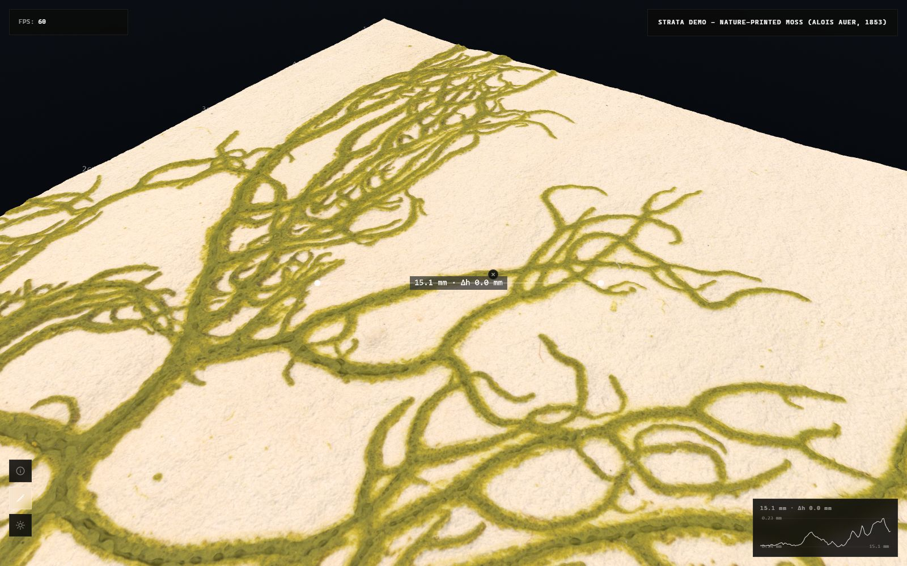

# Measuring

The viewer measures in real units because the dataset stores the physical
pixel size and the height range of each channel.

Click the ruler button on the left edge to enter measure mode. Click a
first point on the piece, move the mouse and click a second point. The
measurement is pinned and its label stays on screen.

The label shows the distance between the two points. Measurements are
anchored to the surface, so they take the height of the relief into
account, not only the distance on the plane.

You can pin several measurements. Each one has a small cross to delete it,
and the Clear measurements link in the controls panel removes them all.

A pinned measurement can also show a profile of the surface along its
line, which is a quick way to read the shape of a stroke or a fibre.

Note that measurements read the height from the channel that is currently
loaded. The Relief only channel gives the cleanest profiles, because the
warp of the paper is filtered out.
