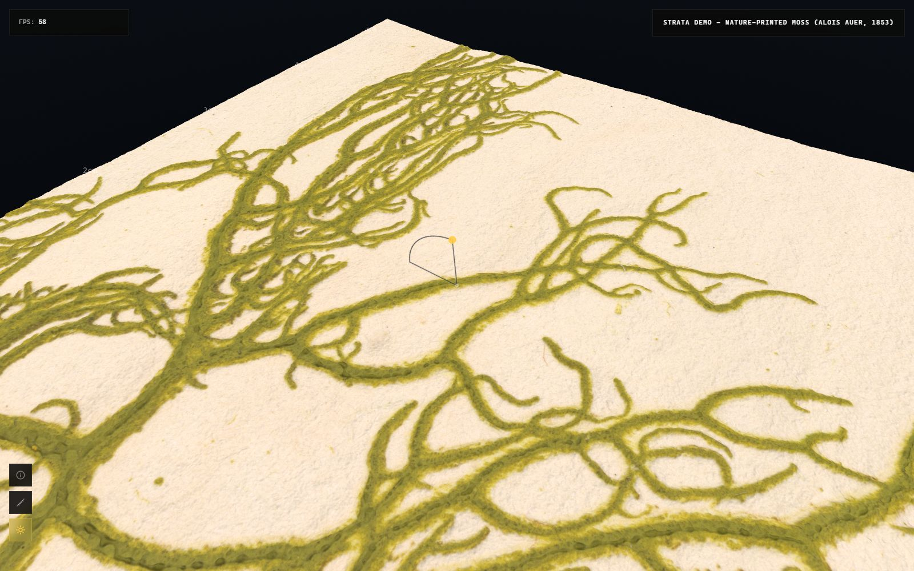
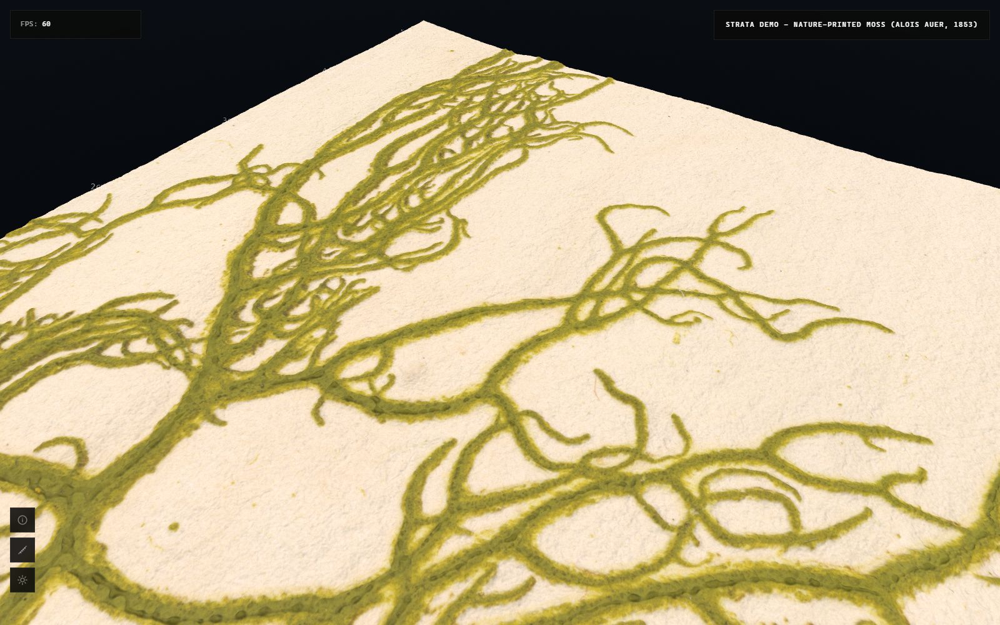
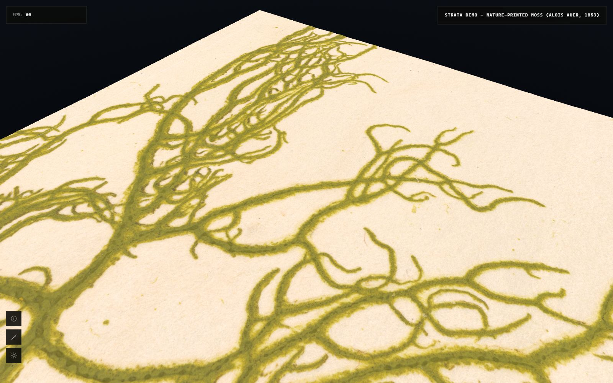
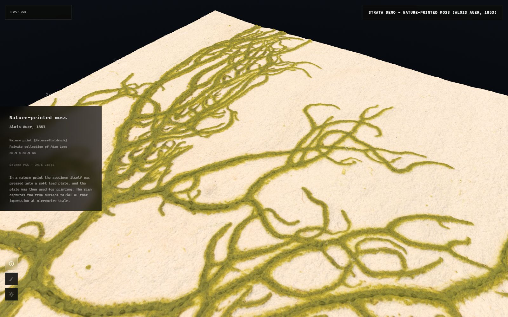

# A tour of the viewer

## Moving around

The left mouse button orbits, the right one pans and the wheel zooms. By
default the camera orbits around the surface point at the centre of the
view, which feels natural when you are close to the relief. You can turn
this off in the controls panel (Orbit around view centre).

The controls panel opens when you click the title chip at the top right.

## Light

The sun button on the left edge enters light mode. Move the mouse over the
piece and a small sphere shows the light direction. Click to fix it. You
can also hold Shift and drag with the left button at any time, without
entering the mode. The Animate light option in the controls panel moves
the light slowly on its own, which is a good way to read the relief.

## Height channels

The sample has two height channels. Relief only (HF) shows the fine relief
of the moss with the warp of the paper filtered out. Full surface shows
everything, including the warp. The number next to each option is the real
height range of that channel in millimetres, read from the dataset.

The Z exaggeration slider scales the relief. The default for the HF
channel is 4x. Set it to 1 for true proportions.

## About the piece

The i button opens a panel with information about the piece: title,
author, date, technique, collection and scanner.

## Backgrounds and shadows

The controls panel offers four backgrounds (Flat, Spotlight, Space and
Black) and an optional floor grid. Shadows can be switched off, and three
sliders control their bias, intensity and softness.

## Scale

The rulers along two edges of the piece are real units, drawn from the
pixel size stored in the dataset. One tick every 5 mm, one label every
centimetre.

## Performance controls

Max SSE sets the screen space error the streamer aims for. Lower values
load more detail sooner. Max tiles caps how many tiles can be alive at
once. Debug wireframes and Tile labels show how the quadtree splits the
surface, which is useful to understand what the streamer is doing.
